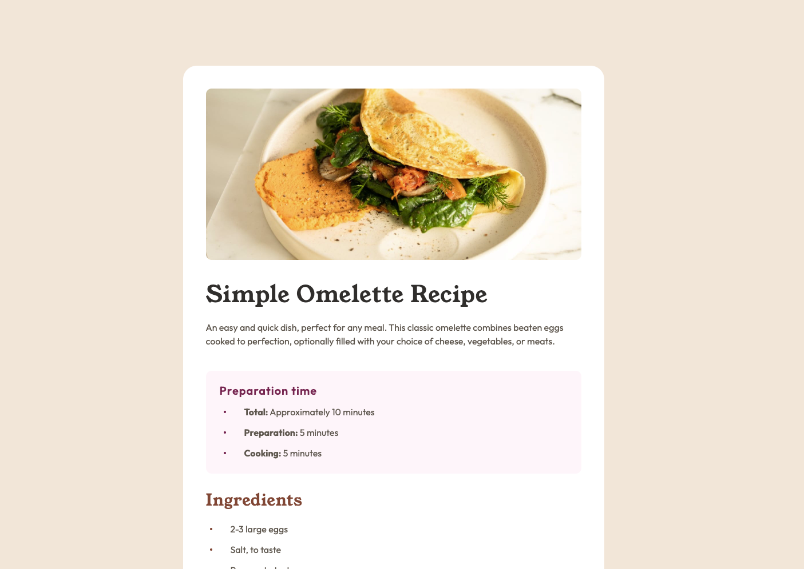
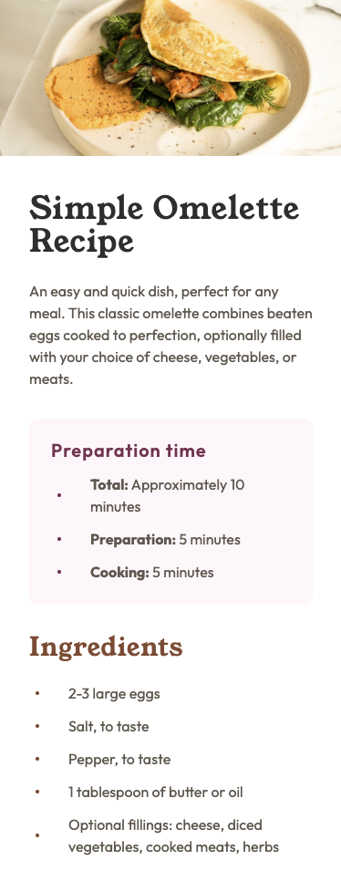

<!-- @format -->

# Frontend Mentor - Recipe page solution

This is a solution to the [Recipe page challenge on Frontend Mentor](https://www.frontendmentor.io/challenges/recipe-page-KiTsR8QQKm). Frontend Mentor challenges help you improve your coding skills by building realistic projects.

## Table of contents

- [Frontend Mentor - Recipe page solution](#frontend-mentor---recipe-page-solution)
  - [Table of contents](#table-of-contents)
  - [Overview](#overview)
    - [Screenshot](#screenshot)
    - [Links](#links)
  - [My process](#my-process)
    - [Built with](#built-with)
    - [What I learned](#what-i-learned)
    - [Useful resources](#useful-resources)
  - [Author](#author)

## Overview

### Screenshot

Desktop

Mobile

### Links

- Solution URL: [Netlify](https://sf-fm-recipe-page.netlify.app)
- Live Site URL: [Girhub repo](https://github.com/serfoll/fm-recipe-page)

## My process

### Built with

- Semantic HTML5 markup
- CSS custom properties
- Flexbox
- CSS Grid
- Mobile-first workflow
- BEM naming convention

### What I learned

- Building minimal design system using flexible tokens (colors, typography, spacing scales)
- Table styling
- Custom list marker using CSS
- Component layout approach
- Retracing image to design using Figma

### Useful resources

- [Figma](https://www.figma.com) - This helped me retrace the design images for more accurate spacing

- [CSS ::marker Pseudo-element](https://www.w3schools.com/cssref/sel_marker.php) - This helped me with creating custom style for list elements.

## Author

- Frontend Mentor - [@serfoll](https://www.frontendmentor.io/profile/serfoll)
- Twitter - [@sergio_fol](https://www.twitter.com/sergio_fol)
